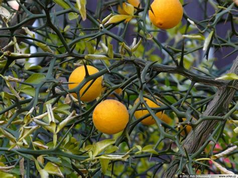
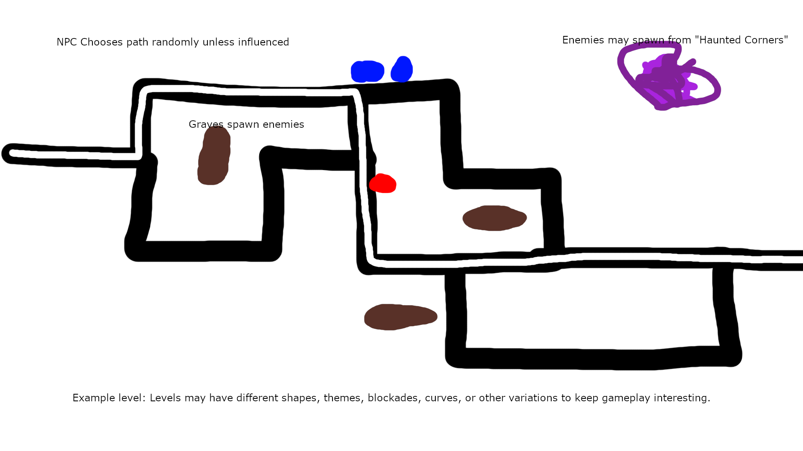

1. Planter
2. Haunted
3. Juggling many things at once
4. Multiple worlds
    1. Must keep moving between them (3)
    2. Worlds interact
5. Keep ignorant 3rd party human NPC safe
    1. Scarable?
6. Use plants as a weapon
7. Action game
8. 3D fixed camera angle (verticality?)
9. Minimal UI / HUD
10. NPC = party of NPCs?
    1. NPCs that are possessed by enemies scatter non-possessed NPCs and chase them slowly like zombies
11. Moving plants
    1. Ivy grows over time
12. Name:
    1. GarDEADner

# New Ideas
13. Enemies come in waves?
14. Can disable spawners?
15. Ghost enemy type = mole:
    1. Can disable plants
    2. Must be reenabled using watering can or flashlight
16. Can possess and move plants
17. Avoid corralling NPC
18. Needs progression (I guess)
    1. Unlocks plants
    2. Plants can grow faster

# Story
You are a dead gardener who protects those who walk your garden from the spirits that inhabit it using enchanted plants.
- Story changes based on success in certain levels?

# Setting
- Botanical garden
    - Sub sections (levels) representing flora (and cultures, architecture?) from different parts of the world.
        - Different subsections have different challenges (modify gameplay slightly).
- Night time

# Gameplay
- Two worlds
    - Same shape
    - Overworld
        - NPC
        - Player hosts
        - Plants (impact Nether)
    - Nether
        - Player (impacts Overworld)
        - Enemy spirits
    - Everything is visible from the Nether
    - While in the Overworld enemy spirits are not visible
- Player uses hosts to grow plants
    - Seed bag
    - Watering can
    - Flashlight
- Limited number of hosts
- Teleport between hosts that have already been possessed (Using number keys?)
- Plants
    1. Willow Wall
        - Destructible by certain enemy types
        - Upgrade (by using more resources)
        - 
    2. Moonflower
        - Make light
    3. Bradford Pear
        - Attracts the NPC if grown with light
        - Repels the NPC if grown with water
    4. Holy Basil
        - Attracts the Spirits if grown with water
        - Repels the Spirits if grown with light
    5. Hungry Water Lily
        - Attacks NPC and Spirits
        - 
    6. Visibility Vines
        - All Spirits are visible while in the area of the vines
- Enemy Spirits
    1. Mindless
        - Walk mindlessly towards the NPC
        - No avoidance of plants
        - Will destroy Willow Walls
    2. Phalanx
        - Walks slower than a Mindless
        - Cannot be eaten by the Hungry Water Lily
    3. Disciple
        - Ignores the effects of Holy Basil
    4. Long-Leg
        - Walks over Willow Walls
    - Come from "Haunted Corners" around the edge of the screen or from graves within the gardens
    - Do not kill the NPC in one hit. Aim to thwart the player a few times before making them lose.
- NPC
    - Becomes scared and panics while it can see Spirits.
    - Question mark above head when choosing path in garden
        - Change to icon to symbolize why path was chosen
- Level settings / behaviour
    - 

# Engine
- ***Extremely*** specialized custom 3D engine
- Minimum target hardware:
    - Vulkan 1.0
    - Quad core CPU
    - 30 FPS
- Vulkan
- Single image and 3D file format (GLTF)
- Multiplayer?
    - NO.
- Cross-platform
    - YES!